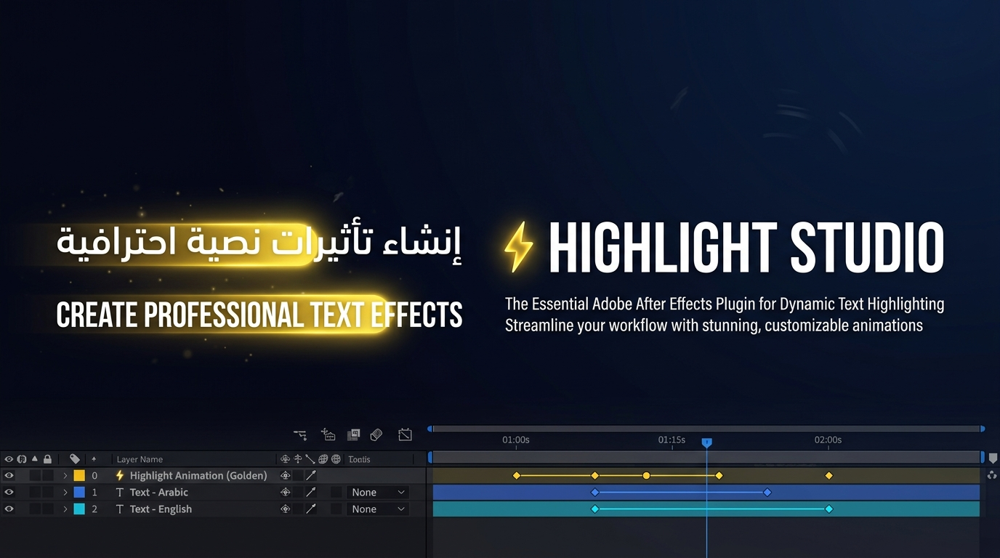

<p align="center">
  
</p>

<h1 align="center">⚡ Highlight Studio</h1>

<p align="center">
  <strong>Professional Text Highlighting Plugin for Adobe After Effects</strong><br/>
  <sub>Create stunning, animated text highlight effects — supporting Arabic, Hebrew, Latin, and all mixed-direction layouts.</sub>
</p>

<p align="center">
  <a href="#-quick-start"></a>
  <a href="LICENSE"></a>
  <a href="#-compatibility"></a>
  <a href="#"></a>
</p>

---

## ✨ What is Highlight Studio?

**Highlight Studio** is a CEP (Common Extensibility Platform) panel for Adobe After Effects that generates perfectly-aligned, animated highlight boxes behind your text — **per-line, per-word, fully automated**. It intelligently detects text layout, paragraph justification, BiDi direction, and line wrapping to produce pixel-perfect results in a single click.

> _No more manually creating shapes, aligning them to each line, and keyframing them one by one._

---

## 🎬 Key Features

### 🎯 Intelligent Text Analysis
- **Auto line-break detection** — Accurately identifies visual line breaks even with complex word-wrap behavior.
- **Paragraph justification awareness** — Correctly handles Left, Right, Center, and **Justified (Full)** text with last-line detection.
- **BiDi support** — Full support for **Arabic, Hebrew, Latin**, and mixed-direction paragraphs with per-line RTL/LTR detection.

### 🎨 Professional Color System
- **Two-way sync** — Changes in the panel reflect instantly in AE, and changes in AE reflect back in the panel.
- **Master + Local color architecture** — Set a global color for all lines, or override individual lines with local colors.
- **Live color preview** — Drag the color picker and see the highlight update in real-time.
- **Scope control** — Choose between "All Lines" (master) and "Selected Line" (local override) with a single toggle.

### 🎞️ Animation Engine
- **Write-on animation** — Built-in smooth reveal animation with customizable easing.
- **Sequential mode** — Lines animate one after another (end-to-start chaining).
- **Stagger mode** — Lines animate with overlapping delays for a flowing effect.
- **Per-line timing** — Control speed and gap/stagger duration independently.

### 🧠 Smart Update System
- **Snapshot & Reconcile** — When updating an existing highlight, local color overrides and custom tweaks are preserved automatically.
- **Non-destructive workflow** — All highlight shapes are expression-driven and respond to font size changes, layer transforms, and timeline scrubbing.
- **One-click apply/update/clear** — A unified smart button handles creation, update, and removal.

### ⚙️ Expression-Driven Architecture
Every highlight box uses After Effects expressions for:
- **Dynamic resizing** — Boxes scale proportionally when font size changes.
- **Leading-aware positioning** — Vertical positions adapt to line spacing and leading changes.
- **Master/Local switching** — A checkbox expression switches between master controls and per-line overrides.

---

## 🚀 Quick Start

### Installation

1. **Clone or download** this repository:
   ```bash
   git clone https://github.com/wittybrandcode/Highlight-Studio.git
   ```

2. **Copy the folder** to your CEP extensions directory:

   | OS | Path |
   |---|---|
   | **Windows** | `C:\Program Files (x86)\Common Files\Adobe\CEP\extensions\` |
   | **macOS** | `/Library/Application Support/Adobe/CEP/extensions/` |

3. **Enable unsigned extensions** (for development):
   - **Windows**: Open `regedit` → navigate to `HKEY_CURRENT_USER\SOFTWARE\Adobe\CSXS.11` → create a string value `PlayerDebugMode` set to `1`.
   - **macOS**: Run in Terminal:
     ```bash
     defaults write com.adobe.CSXS.11 PlayerDebugMode 1
     ```
   > Replace `CSXS.11` with your CEP version (e.g., `CSXS.9` for CC 2019).

4. **Restart After Effects** → Go to `Window` → `Extensions` → **Highlight-Studio**.

---

## 🎮 How to Use

### Basic Workflow

```
1. Select a Text Layer in your composition
2. Adjust settings in the Highlight Studio panel:
   • Choose a Preset (Marker / Clean / Caption) or customize
   • Set Color, Padding, and Roundness
   • Enable/disable animation and set timing
3. Click "⚡ Apply / Update Highlight"
4. Done! Highlight shapes are created and linked to your text.
```

### Color Modes

| Mode | How to Use | Behavior |
|---|---|---|
| **All Lines** | Click "All Lines (الكل)" button | Updates `Master Highlight Color` on the text layer — all lines follow. |
| **Selected Line** | Select a specific `[Line N]` shape layer, then click "Selected Line (السطر المحدد)" | Sets `Local Color` on that line only and detaches it from master. |

### Keyboard Shortcuts

| Action | Shortcut |
|---|---|
| Apply / Update | `Click` the ⚡ button |
| Clear Highlight | `Alt+Click` or `Right-Click` the ⚡ button |

---

## 📁 Project Structure

```
Highlight-Studio/
├── CSXS/
│   └── manifest.xml          # CEP extension manifest (AE CC 2017+)
├── client/
│   ├── index.html             # Panel UI
│   ├── css/
│   │   └── style.css          # Dark-themed panel styles
│   └── js/
│       ├── CSInterface.js     # Adobe CEP interface library
│       └── app.js             # Panel logic & two-way sync
├── host/
│   └── hostscript.jsx         # ExtendScript engine (all AE logic)
├── docs/
│   ├── hero_banner.jpg        # README banner
│   └── SMART_SYNC_PLAN.md     # Architecture design document
├── .debug                     # CEP debug port config
├── .gitignore
├── LICENSE
└── README.md
```

---

## 🏗️ Architecture

```
┌──────────────────────────────────────────────────────────────────┐
│                        CEP Panel (HTML/JS)                       │
│  ┌─────────────┐  ┌──────────────┐  ┌─────────────────────────┐ │
│  │  Color Picker│  │  Presets     │  │  Animation Controls     │ │
│  │  Scope Btns  │  │  Marker/... │  │  Sequential / Stagger   │ │
│  └──────┬───────┘  └──────┬──────┘  └────────────┬────────────┘ │
│         │                 │                       │              │
│         └─────────────────┴───────────────────────┘              │
│                           │                                      │
│                    csInterface.evalScript()                       │
│                           │                                      │
├───────────────────────────┼──────────────────────────────────────┤
│                           ▼                                      │
│              ExtendScript Engine (hostscript.jsx)                 │
│  ┌─────────────────────────────────────────────────────────────┐ │
│  │  $._smartHighlighter                                        │ │
│  │  ├── scanParagraph()     → Line-break & metrics detection   │ │
│  │  ├── createHighlight()   → Shape layer generation           │ │
│  │  ├── setQuickColor()     → Live two-way color application   │ │
│  │  ├── getLayerState()     → AE → Panel state sync            │ │
│  │  ├── snapshotBoxes()     → Preserve local overrides         │ │
│  │  ├── removeHighlight()   → Clean removal                    │ │
│  │  └── smartHighlight()    → Unified apply/update entry point │ │
│  └─────────────────────────────────────────────────────────────┘ │
│                           │                                      │
│                           ▼                                      │
│              After Effects Composition                           │
│  ┌─────────────────────────────────────────────────────────────┐ │
│  │  Text Layer (Master Controls)                               │ │
│  │  ├── Master Highlight Color  [Color Control]                │ │
│  │  ├── Master Padding X/Y      [Slider Control]              │ │
│  │  ├── Master Roundness         [Slider Control]              │ │
│  │  │                                                          │ │
│  │  └─ Children (Shape Layers, comment="SMART_HL_PRO_LAYER")  │ │
│  │     ├── [Line 1] → Local Color, Padding, Progress          │ │
│  │     ├── [Line 2] → Local Color, Padding, Progress          │ │
│  │     └── [Line N] → ...                                     │ │
│  └─────────────────────────────────────────────────────────────┘ │
└──────────────────────────────────────────────────────────────────┘
```

---

## 🔧 Technical Details

### Expression System

Each shape layer contains expression-driven properties that respond to runtime changes:

```javascript
// Size expression (simplified)
var useM = effect("Use Master Controls")("Checkbox");
var pX = (useM == 1) ? parent.effect("Master Padding X")("Slider") 
                     : effect("Local Padding X")("Slider");
var fontRatio = curFS / baseFS;
var fullW = (baseWidth * fontRatio) + pX * 2;
var p = clamp(effect("Progress")("Slider") / 100, 0, 1);
[fullW * p, fullH];
```

### Master/Local Color Architecture

```javascript
// Fill Color expression
var useM = effect("Use Master Controls")("Checkbox");
var mCol = parent.effect("Master Highlight Color")("Color");
var lCol = effect("Local Color")("Color");
// If local override is active OR local has keyframes → use local
(useM == 0 || lCol.numKeys > 0) ? lCol.value : mCol;
```

### Justified Text Handling

The engine detects `FULL_JUSTIFY_LASTLINE_*` paragraph modes and:
- Assigns `rFull.width` (full paragraph width) to all non-last lines.
- Preserves measured width for the last line of each paragraph.
- Correctly identifies all four justify variants (left, right, center, full).

---

## 🌍 Language & BiDi Support

| Feature | Status |
|---|---|
| Arabic (العربية) | ✅ Full RTL support |
| Hebrew (עברית) | ✅ Full RTL support |
| Latin (English, French, etc.) | ✅ Full LTR support |
| Mixed BiDi (Arabic + English) | ✅ Per-line auto-detection |
| Center alignment | ✅ Centered box positioning |
| Justified text | ✅ Full-width line detection |

---

## 🔌 Compatibility

| Requirement | Minimum Version |
|---|---|
| Adobe After Effects | CC 2017 (v14.0) and later |
| CEP Runtime | CSXS 7.0+ |
| OS | Windows 10+ / macOS 10.12+ |

---

## 🤝 Contributing

Contributions are welcome! Feel free to:

1. Fork the repository
2. Create a feature branch: `git checkout -b feature/amazing-feature`
3. Commit your changes: `git commit -m 'Add amazing feature'`
4. Push to the branch: `git push origin feature/amazing-feature`
5. Open a Pull Request

---

## 📄 License

This project is licensed under the **MIT License** — see the [LICENSE](LICENSE) file for details.

---

## 🙏 Credits

Built with ❤️ by [Witty Brand Code](https://github.com/wittybrandcode)

---

<p align="center">
  <sub>If you find this useful, consider giving it a ⭐ on GitHub!</sub>
</p>
