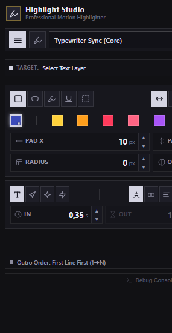
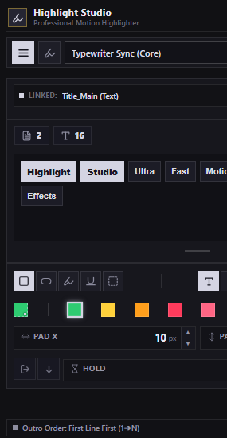

<p align="center">
  
</p>

<h1 align="center">Highlight Studio v1.0.0</h1>

<p align="center">
  <strong>The Ultimate Industrial Text Highlighting & Caption Motion Suite for Adobe After Effects</strong><br/>
  <sub>Interactive word tokens selection, cumulative multi-color phrase highlights, Hormozi elastic spring dynamics, Vox speed-ramp wipes, and zero-distortion invisible anchors.</sub>
</p>

<p align="center">
  <a href="#-quick-start"></a>
  <a href="LICENSE"></a>
  <a href="#-compatibility"></a>
  <a href="#"></a>
</p>

---

## 📸 Interface Overview

<table align="center" width="100%">
  <tr>
    <td width="50%" align="center" valign="top">
      <h4><b>Paragraph & Lines View</b></h4>
      <br/>
      <sub>Full-line cascading highlights, auto direction (LTR/RTL/Center), outro timing & custom presets.</sub>
    </td>
    <td width="50%" align="center" valign="top">
      <h4><b>Interactive Phrase View</b></h4>
      <br/>
      <sub>Clickable word tokens board, multi-word selection, cumulative colors & instant click-to-erase.</sub>
    </td>
  </tr>
</table>

---

## ✨ Why Highlight Studio?

Highlighting subtitles, kinetic typography, and documentary quotes in Adobe After Effects has traditionally required tedious shape layer positioning, cumbersome track mattes, or complex manual expression rigging.

**Highlight Studio** redefines this workflow entirely with an **industrial CEP extension** engineered for professional editors and motion graphic designers:
- **Zero Text Distortion**: Highlighting happens without injecting brackets `[...]` or modifying your `Source Text`.
- **Full BiDi & International Support**: Native support for **Arabic**, **Hebrew**, **Latin**, mixed BiDi, and justified paragraphs.
- **Precision Metrics**: Subpixel accurate padding, roundness, opacity, and timing controls with interactive horizontal scrubbers.
- **Industrial Slate Aesthetic**: Sharp 0-radius architectural design, high-contrast off-white tones, and 10-color square swatches with dynamic recent color memory.

---

## 🎬 Core Features

### 🔤 1. Interactive Word Tokens Board & Phrase Highlighting
- **Live Text Parsing**: Automatically scans the active AE text layer and populates an interactive words board.
- **Click & Drag Multi-Selection**: Select single words, drag across multiple tokens, or use `Shift + Click` for contiguous ranges.
- **Cumulative Multi-Color Highlights**: Apply emerald green to key nouns, amber yellow to verbs, and coral crimson to dates—all on the same text layer without clearing previous phrases.
- **Click-to-Erase Engine**: Clicking an already highlighted word in the tokens board instantly removes its highlight from After Effects.
- **Live Token Metrics**: Instant counter badges for selected word count and character count.
- **Resizable Tokens Workspace**: Integrated vertical grip handle to drag and expand the tokens board for lengthy paragraphs.

### 🎢 2. Physics-Based Motion Dynamics
- **Hormozi Elastic Overshoot (`pop`)**: Mathematically continuous ($C^0/C^1$) harmonic damped spring bounce ($decay = 7.5, freq = 4.2, amp = 18.0$) that settles cleanly to 100% with zero frame popping.
- **Vox Speed-Ramp (`wipe`)**: Punchy 25% attack followed by silky 80% cinematic deceleration inspired by modern investigative video journalism.
- **Typewriter Sync (`typewriter`)**: Proportional character-by-character progression synchronized with the text layer's Range Selector animator.
- **Snap Jump (`snap`)**: 0-frame instantaneous jump cut for high-energy social reels and TikTok captioning.

### ⏱️ 3. Line Sequencing & Outro Timing
- **Sequential Delay (`stagger`)**: Configurable gap timing between lines for cascading reveal animations.
- **Dedicated Outro Animation**: Full exit transitions with reverse or forward order toggling (`1➔N` vs `N➔1`).
- **Hold Duration**: Precise hold timer before phrase auto-dismissal.
- **Marker Synchronization**: Optional audio marker triggering for lyric sync and speech alignment.

### 🎨 4. Studio Color Palette & Memory
- **10 Curated Studio Swatches**: Amber Yellow, Sunset Orange, Coral Crimson, Hot Rose, Vivid Purple, Electric Indigo, Cyan Teal, Emerald Green, Lime Highlighter, and Pure White.
- **Dynamic Recent Color Memory**: Automatically tracks your last custom picked color and persists it to `localStorage`.
- **Industrial Contrast**: Elegant off-white (`#d4d4e2`) and off-black (`#161620`) visual language—no distracting neon borders.

### 💾 5. Custom Presets System
- **Save & Reuse**: Store your favorite combination of shape, color, padding, radius, and motion dynamics with one click (`💾`).
- **LocalStorage Persistence**: Custom presets survive panel reloads and After Effects restarts.
- **Sharp Custom Dropdown**: Custom industrial dropdown selector with instant delete (`✕`) for user-created presets.

---

## 🚀 Quick Start & Installation

### 1. Download / Clone
Clone this repository directly into your local machine:
```bash
git clone https://github.com/wittybrandcode/Highlight-Studio.git
```

### 2. Copy to CEP Extensions Directory

Copy the `Highlight-Studio` folder into your operating system's CEP directory:

| OS | Target Path |
|---|---|
| **Windows** | `C:\Program Files (x86)\Common Files\Adobe\CEP\extensions\Highlight-Studio` |
| **macOS** | `/Library/Application Support/Adobe/CEP/extensions/Highlight-Studio` |

> [!TIP]
> On Windows, you can also use the user-specific directory:  
> `%APPDATA%\Adobe\CEP\extensions\Highlight-Studio`

### 3. Enable PlayerDebugMode (Required for Unsigned Extensions)

#### On Windows:
Open PowerShell as Administrator and run:
```powershell
# Enable debug mode for CSXS 7 through 12
7..12 | ForEach-Object {
    reg add "HKCU\Software\Adobe\CSXS.$_" /v PlayerDebugMode /t REG_SZ /d "1" /f
}
```

#### On macOS:
Open Terminal and run:
```bash
defaults write com.adobe.CSXS.7 PlayerDebugMode 1
defaults write com.adobe.CSXS.8 PlayerDebugMode 1
defaults write com.adobe.CSXS.9 PlayerDebugMode 1
defaults write com.adobe.CSXS.10 PlayerDebugMode 1
defaults write com.adobe.CSXS.11 PlayerDebugMode 1
defaults write com.adobe.CSXS.12 PlayerDebugMode 1
```

### 4. Launch in After Effects
1. Launch or restart **Adobe After Effects** (CC 2017 through 2026+).
2. In the top menu, go to **Window** → **Extensions** → **Highlight-Studio**.
3. Dock the panel anywhere in your workspace.

---

## 🎮 Workflow & Shortcuts

### Highlighting Full Paragraphs & Lines
1. Select any text layer in your active composition.
2. In the **Paragraph & Lines** tab, choose your preferred preset or adjust Shape, Direction, Swatch Color, Padding, and Timing.
3. Click the **Apply Highlight** button (`⚡`).

### Highlighting Word-by-Word Phrases
1. Select a text layer and switch to the **Phrase Highlight** tab (`🖊`).
2. The interactive tokens board will display all words from the layer.
3. Click or drag to select target words.
4. Choose an animation curve and swatch color, then click **Apply**.
5. Repeat across different words to build a rich, multi-colored typography scene!

### Keyboard & Mouse Shortcuts

| Shortcut | Action |
|---|---|
| `F5` / `Ctrl + R` | Reload panel interface & re-read host state |
| `Shift + Click` on Tokens | Select continuous range of words on tokens board |
| `Click & Drag` on Tokens | Continuous swipe selection across tokens |
| `Click` on Applied Word | Instant click-to-erase for highlighted word |
| `Horizontal Drag` on Labels | Scrub values (`Pad X`, `Pad Y`, `Radius`, `Opacity`, `In`, `Out`) |
| `Shift + Stepper Click` | Adjust value by 10× step |
| `Alt + Stepper Click` | Adjust value by 0.1× micro-step |

---

## 🏗️ Architecture

Highlight Studio follows a strict, decoupled layered architecture separating CEP UI orchestration from ExtendScript host automation:

```
Highlight-Studio/
├── CSXS/
│   └── manifest.xml            # CEP Extension Manifest (CC 2017 - 2026+)
├── client/
│   ├── index.html              # Clean semantic HTML5 layout
│   ├── css/
│   │   └── style.css           # Industrial slate design tokens (0 radius)
│   └── js/
│       ├── CSInterface.js      # Official Adobe CEP Bridge
│       ├── core/
│       │   ├── Config.js       # Shared defaults & constants
│       │   ├── State.js        # Reactive client-side state store
│       │   ├── DOM.js          # Cached DOM element references
│       │   └── Bridge.js       # CSInterface dispatch & tab router
│       ├── services/
│       │   ├── SyncService.js  # Live two-way synchronization engine
│       │   └── Actions.js      # Apply, Clear, and Preset triggers
│       ├── modules/
│       │   ├── Controls.js     # Steppers, scrubbers, swatches & inputs
│       │   ├── PresetsManager.js # Custom presets & localStorage engine
│       │   └── PhraseManager.js  # Interactive tokens board & multi-selection
│       └── app.js              # Application bootstrapper & orchestrator
├── host/
│   ├── hostscript.jsx          # ES3 host entry point & module aggregator
│   └── modules/
│       ├── Config.jsx          # Expression templates & effect constants
│       ├── Utils.jsx           # ES3 stringifyJSON, math & color conversions
│       ├── TextScanner.jsx     # BiDi analysis, line wrapping & character bounds
│       ├── InvisibleAnchors.jsx# Non-destructive invisible anchor system
│       ├── HighlightBuilder.jsx# Paragraph shape generation & expression rigging
│       ├── TagManager.jsx      # Phrase-level word parsing & applied tray
│       ├── TypewriterEngine.jsx# Proportional typewriter animators
│       ├── Recipes.jsx         # Factory animation recipes (Pop, Wipe, etc.)
│       └── ControllerBridge.jsx# Real-time parameter sync & layer cleanup
├── assets/
│   ├── hero_banner.jpg         # High-resolution hero banner
│   └── screenshots/
│       ├── panel_paragraph_view.png  # Paragraph & Lines panel view
│       └── panel_phrase_view.png     # Phrase Highlight panel view
├── LICENSE                     # MIT License
└── README.md                   # Documentation & User Guide
```

---

## 🌍 Language & BiDi Support

| Language / Alignment | Support Status | Notes |
|---|---|---|
| **Arabic** | ✅ Full Native Support | Right-to-left layout, Kashida elongation, subpixel kerning |
| **Hebrew** | ✅ Full Native Support | Right-to-left character sequencing |
| **Latin (English, French, etc.)** | ✅ Full Native Support | Standard left-to-right progression |
| **Mixed BiDi** | ✅ Automatic Per-Line | Detects dominant character script per line automatically |
| **Center Justified** | ✅ Full Native Support | Automatically positions box centers and expansion |
| **Fully Justified** | ✅ Full Native Support | Dynamic line-width tracking across paragraph bounds |

---

## 🔌 Compatibility & Requirements

| Specification | Requirement |
|---|---|
| **Host Application** | Adobe After Effects CC 2017 (v14.0) through 2026+ |
| **CEP Engine** | CSXS 7.0 and higher |
| **Operating System** | Windows 10, Windows 11 / macOS 10.14+ (Intel & Apple Silicon via Rosetta/Native) |
| **Architecture** | 64-bit |

---

## 📄 License

This project is licensed under the **MIT License** — see the [LICENSE](LICENSE) file for complete details.

---

<p align="center">
  Crafted with precision for motion graphic artists worldwide.
</p>
