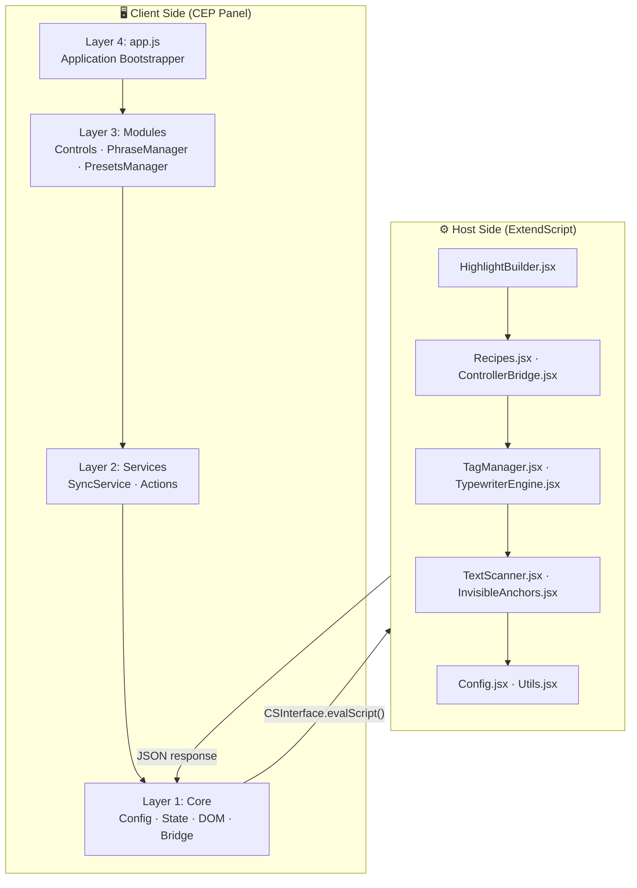
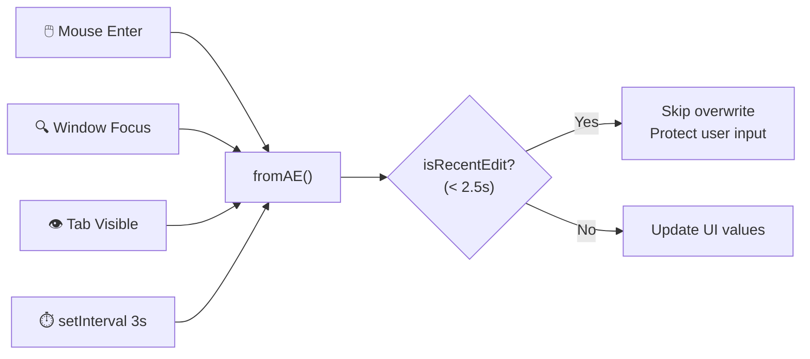
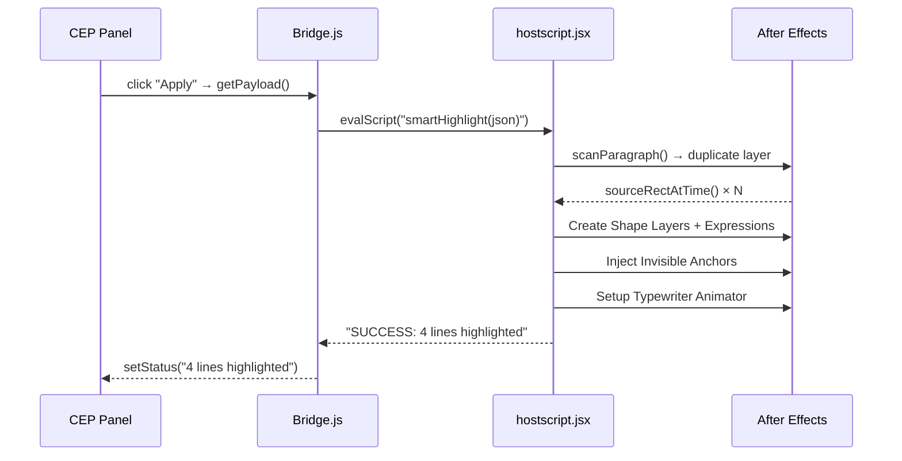
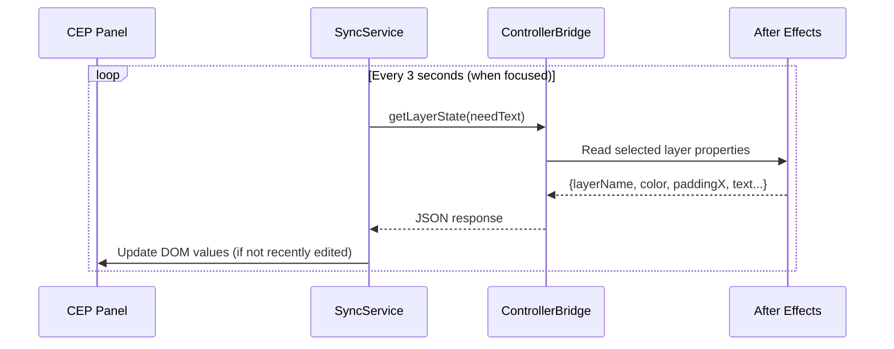

# 🔬 التقرير الذري الشامل — Highlight Studio v1.0.0
### تحليل تقني هيكلي تصميمي معمّق لإضافة Adobe After Effects CEP

---

## 📊 الملخص التنفيذي

| المقياس | القيمة |
|---|---|
| **النوع** | إضافة CEP (Common Extensibility Platform) لـ Adobe After Effects |
| **الإصدار** | v1.0.0 |
| **الترخيص** | MIT |
| **عدد الملفات الإجمالي** | 31 ملف |
| **عدد ملفات الكود المخصص** | 22 ملف (JS + JSX + CSS + HTML) |
| **إجمالي أسطر الكود المخصص** | 8,530 سطر |
| **حجم الكود المخصص** | 363.0 KB |
| **حجم المشروع الكامل** | 956.4 KB |
| **التوافق** | After Effects CC 2017 (v14.0) — 2026+ |
| **محرك CEP** | CSXS 7.0+ |
| **المستودع** | `github.com/wittybrandcode/Highlight-Studio` |

---

## 🏗️ الفصل الأول: الهندسة المعمارية (Architecture)

### 1.1 النمط المعماري الشامل

يعتمد المشروع على **نمط معماري طبقي مصغّر (Layered Micro-Kernel Architecture)** مقسّم إلى جانبين مستقلين تمامًا:



### 1.2 فصل المسؤوليات (Separation of Concerns)

| الطبقة | المسؤولية | الملفات |
|---|---|---|
| **Core** | التهيئة، حالة التطبيق، التخزين المؤقت للـ DOM، جسر التواصل مع AE | `Config.js`, `State.js`, `DOM.js`, `Bridge.js` |
| **Services** | المزامنة الثنائية الاتجاه، تجميع وإرسال الأوامر | `SyncService.js`, `Actions.js` |
| **Modules** | عناصر التحكم التفاعلية، إدارة القوالب، لوحة الكلمات | `Controls.js`, `PhraseManager.js`, `PresetsManager.js` |
| **Boot** | تنسيق الإقلاع وترتيب التهيئة الطبوغرافية | `app.js` |
| **Host Core** | الثوابت، المرافق، تحليل JSON في بيئة ES3 | `Config.jsx`, `Utils.jsx` |
| **Host Analysis** | مسح الفقرات وقياس الأبعاد، المراسي المخفية | `TextScanner.jsx`, `InvisibleAnchors.jsx` |
| **Host Logic** | تحليل الوسوم، محرك الآلة الكاتبة | `TagManager.jsx`, `TypewriterEngine.jsx` |
| **Host Rendering** | وصفات الأنماط والحركة، بناء الأشكال | `Recipes.jsx`, `HighlightBuilder.jsx` |
| **Host Bridge** | مزامنة ثنائية للمعلمات الحية | `ControllerBridge.jsx` |

### 1.3 تحميل الوحدات (Module Loading)

#### الجانب العميل — Script Tags بترتيب طبوغرافي:
```html
<!-- 1. Adobe CEP Bridge -->
<script src="js/CSInterface.js"></script>

<!-- 2. Core Foundation Layer -->
<script src="js/core/Config.js"></script>
<script src="js/core/State.js"></script>
<script src="js/core/DOM.js"></script>
<script src="js/core/Bridge.js"></script>

<!-- 3. Services Layer -->
<script src="js/services/SyncService.js"></script>
<script src="js/services/Actions.js"></script>

<!-- 4. Feature Modules Layer -->
<script src="js/modules/Controls.js"></script>
<script src="js/modules/PresetsManager.js"></script>
<script src="js/modules/PhraseManager.js"></script>

<!-- 5. App Orchestrator -->
<script src="js/app.js"></script>
```

#### الجانب المضيف — `#include` Preprocessor Directives (ES3):
```jsx
#include "modules/Config.jsx"
#include "modules/Utils.jsx"
#include "modules/TextScanner.jsx"
#include "modules/TagManager.jsx"
#include "modules/InvisibleAnchors.jsx"
#include "modules/TypewriterEngine.jsx"
#include "modules/ControllerBridge.jsx"
#include "modules/Recipes.jsx"
#include "modules/HighlightBuilder.jsx"
```

> [!IMPORTANT]
> كل وحدة مضيفة تنتهي بمتغير إثبات تحميل (`var SMART_HL_CONFIG_LOADED = true;`) يتم فحصه في `hostscript.jsx` عند الإقلاع لضمان تسلسل التحميل الصحيح لجميع الوحدات التسعة.

---

## ⚙️ الفصل الثاني: تحليل الملفات ذريًا (Atomic File Analysis)

### 2.1 الجانب العميل (Client-Side)

---

#### 📄 `client/js/core/Config.js` — 39 سطر · 1.4 KB
**الدور**: مخزن ثوابت التكوين والقوالب الافتراضية.

| المفتاح | القيمة | الغرض |
|---|---|---|
| `defaults.color` | `#3C4BB9` | لون التظليل الافتراضي (أزرق نيلي) |
| `defaults.motion` | `typewriter` | حركة افتراضية: كتابة متزامنة |
| `defaults.lineDuration` | `0.35s` | مدة ظهور السطر الواحد |
| `defaults.paddingX/Y` | `10px` | هوامش التظليل الأفقية والعمودية |

**القوالب المدمجة (3 Built-in Presets)**:
1. **Typewriter Sync (Core)** — مستطيل كامل، كتابة متزامنة، لون أزرق
2. **Vox Documentary** — قلم ماركر، مسح تدريجي، لون أصفر
3. **Clean Underline** — تسطير نظيف، لون سماوي

> [!NOTE]
> القوالب لا تُخزّن في قاعدة بيانات بل كائنات JavaScript ثابتة. القوالب المخصصة تُحفظ في `localStorage`.

---

#### 📄 `client/js/core/State.js` — 31 سطر · 869 B
**الدور**: مخزن الحالة المركزي (Central Reactive State Store).

**حقول الحالة**:
| الحقل | النوع | الغرض |
|---|---|---|
| `mainTab` | `"paragraph" \| "phrases"` | التبويب النشط حاليًا |
| `outroOrder` | `"first" \| "last"` | ترتيب حركة الخروج |
| `lastUserInteraction` | `timestamp` | حماية المدخلات النشطة من الكتابة فوقها |
| `phraseTokens` | `Array<{index, text, charStart, charEnd}>` | كلمات النص المُحلّلة |
| `selectedTokenIndices` | `Array<number>` | فهارس الكلمات المحددة |
| `appliedPhrases` | `Array` | العبارات المطبقة في AE |

**آلية `markInteraction()`**: تسجيل طابع زمني عند كل تفاعل مستخدم لمنع `SyncService` من الكتابة فوق القيم أثناء التحرير (فترة حماية: 2500ms).

---

#### 📄 `client/js/core/DOM.js` — 103 سطر · 6.2 KB
**الدور**: مخزن مؤقت لمراجع عناصر DOM (Cached DOM Element Repository).

**عدد العناصر المرجعية المخزنة مؤقتًا**: **81 عنصرًا** مقسمة إلى:
- **13** عنصر للقوالب والتبويبات
- **26** عنصر لتبويب "الفقرات والأسطر"
- **25** عنصر لتبويب "تظليل العبارات"
- **7** عناصر لشريط الحالة وطرفية التصحيح
- **10** عناصر أخرى

> [!TIP]
> **نمط التخزين المؤقت**: استدعاء `getElementById` مرة واحدة عند التهيئة بدلاً من البحث المتكرر. هذا يحسّن الأداء في بيئة CEF المقيّدة الموارد.

**ملاحظة معمارية**: الوحدة تُهيّئ نفسها ذاتيًا عند تحميلها إذا كان DOM جاهزًا (`readyState !== "loading"`).

---

#### 📄 `client/js/core/Bridge.js` — 151 سطر · 5.9 KB
**الدور**: جسر الاتصال بين الواجهة ومحرك After Effects عبر CSInterface.

**الوظائف الأساسية**:
| الوظيفة | الغرض |
|---|---|
| `ensureLoaded(cb)` | تحميل ديناميكي لـ `hostscript.jsx` من القرص عبر `$.evalFile()` |
| `eval(cmd, cb)` | تنفيذ أوامر ExtendScript وإرجاع النتائج |
| `hexToRgba(hex)` | تحويل HEX → `[r, g, b, 1.0]` بقيم `0..1` لـ AE |
| `hexToRgbaCss(hex, alpha)` | تحويل HEX → `rgba()` CSS string |
| `HS.switchMainTab(tab)` | تبديل التبويبات مع مزامنة الحالة والعرض |
| `HS.setStatus(msg)` | عرض رسائل الحالة في شريط الأسفل |

**منطق تبديل التبويبات**: عند التبديل إلى "العبارات"، يتم استدعاء `HS.Sync.fromAE(true)` بشكل فوري لتحميل نص الطبقة النشطة.

---

#### 📄 `client/js/services/SyncService.js` — 114 سطر · 5.7 KB
**الدور**: محرك المزامنة الثنائية الاتجاه الحية بين لوحة CEP و After Effects.

**استراتيجية المزامنة الذكية (Smart Sync Strategy)**:



**آليات الحماية**:
1. **حماية التركيز**: لا تُحدَّث القيم إذا كان العنصر هو `document.activeElement`
2. **حماية زمنية**: فترة حماية 2500ms بعد آخر تفاعل مستخدم
3. **حماية الرؤية**: لا تُجرى مزامنة خلفية إذا كانت اللوحة مخفية (`document.hidden`)
4. **حماية التزامن**: قفل `isSyncing` لمنع الطلبات المتداخلة

**البيانات المنقولة من AE**: اسم الطبقة، اللون، التعبئة، الهوامش، الاستدارة، النص الكامل (فقط عند تبويب العبارات).

---

#### 📄 `client/js/services/Actions.js` — 200 سطر · 11.2 KB
**الدور**: مُجمّع الحمولات ومُرسل الأوامر (Payload Assembler & Command Dispatcher).

**الأوامر الرئيسية**:

| الأمر | استدعاء Host | الوصف |
|---|---|---|
| `executeSmartAction(false)` | `smartHighlight(jsonPayload)` | تطبيق التظليل الكامل |
| `executeSmartAction(true)` | `removeHighlight()` | إزالة التظليل |
| `applyPhraseHighlight()` | `buildPhraseHighlights(jsonPayload)` | تطبيق تظليل العبارات |
| `clearPhraseHighlight()` | `clearPhraseHighlights()` | مسح كل تظليلات العبارات |

**حمولة الأمر الرئيسي (`getPayload`)** — 17 حقلاً:
```javascript
{
    direction, mode, style, motion, revealUnit, syncMarkers,
    color, opacity, paddingX, paddingY, roundness, animate,
    sequential, outro, outroOrder, lineDuration, outTime, stagger
}
```

**آلية الأمان**: كل أمر يمر عبر `ensureLoaded()` أولاً لضمان تحميل `hostscript.jsx` من القرص، ثم يُغلَّف في `Undo Group` لقابلية التراجع.

---

#### 📄 `client/js/modules/Controls.js` — 561 سطر · 26.3 KB
**الدور**: وحدة التحكم التفاعلية الشاملة — أكبر ملف في الجانب العميل.

**المكونات التفاعلية**:
1. **Shape Buttons**: 5 أزرار أيقونية (Box · Pill · Marker · Underline · Outline) × 2 تبويب
2. **Direction Buttons**: 4 أزرار (Auto · LTR · RTL · Center)
3. **Motion Buttons**: 4 أزرار (Typewriter · Wipe · Pop · Snap) × 2 تبويب
4. **Reveal Unit Buttons**: 3 أزرار (Characters · Words · Lines)
5. **Color Picker + 10 Swatches**: مع ذاكرة آخر لون مخصص
6. **Precision Steppers (▲▼)**: معدّلات `Shift×10` و `Alt×0.1`
7. **Mouse Wheel Scrubbing**: تمرير عجلة الفأرة على حقول الأرقام
8. **Horizontal Drag Scrubbing**: سحب أفقي على التسميات بأسلوب After Effects الأصلي
9. **Chip Toggles**: أزرار تبديل (Sequential · Outro · Markers)
10. **Live Color Application**: تحديث فوري عبر `setQuickColor()` دون إعادة بناء

**نمط السحب الأفقي (Scrub Label Pattern)**:
```
mousedown → record startX, startVal
mousemove → Δx/4 × step × modifier → clamp(min, max)
mouseup → dispatch("change") + cleanup
```

> [!TIP]
> هذا النمط يحاكي سلوك السحب الأصلي في لوحات Adobe الاحترافية، مما يوفر تجربة استخدام مألوفة للمستخدمين.

---

#### 📄 `client/js/modules/PhraseManager.js` — 473 سطر · 23.0 KB
**الدور**: محرك لوحة الكلمات التفاعلية والتحديد المتعدد.

**الميزات الذرية**:

1. **`renderBoard(rawText, layerName)`**: تحليل النص إلى رموز (tokens) وعرضها كأزرار تفاعلية
   - يعالج تقسيم الأسطر (`\r\n|\r|\n`)
   - يحسب `charStart` و `charEnd` لكل كلمة بدقة
   - يحفظ حالة التحديد عبر `lastTokensRawText` لمنع إعادة البناء عند المزامنة

2. **التحديد المتعدد (Multi-Selection)**:
   - `Click`: تحديد/إلغاء كلمة مفردة
   - `Shift+Click`: تحديد نطاق متتابع
   - `Click & Drag`: سحب متواصل عبر كلمات متعددة
   - `Click on Applied`: محو فوري (Click-to-Erase)

3. **`getSelectedPhrases()`**: تجميع الفهارس المتتابعة في مجموعات عبارات مع `charStart/charEnd`

4. **`syncAppliedPhrases()`**: استعلام من AE عن العبارات المطبقة وتحديث الشارات الملونة

5. **`removePhrase(phraseId)`**: حذف تظليل عبارة مفردة من AE

6. **تغيير حجم اللوحة (Resize Handle)**: مقبض سحب عمودي لتكبير وتصغير ارتفاع لوحة الكلمات مع حد أدنى 80px وحد أقصى 500px

---

#### 📄 `client/js/modules/PresetsManager.js` — 419 سطر · 18.2 KB
**الدور**: نظام القوالب المخصصة مع التخزين الدائم.

**تدفق العمل**:
```
init() → loadFromStorage() → populateDropdown() → initEvents()
```

**التخزين**: `localStorage` بمفتاح `highlight_studio_custom_presets_v1`

**القائمة المنسدلة المخصصة**: بُنيت يدويًا كـ `<div class="custom-dropdown">` بدلاً من `<select>` الأصلي لضمان التوافق مع نظام التصميم الصناعي (0-radius، ألوان مخصصة).

**نافذة الحفظ (Modal)**: حوار مخصص بالكامل مع معاينة اللون والإعدادات الحالية قبل التأكيد.

---

#### 📄 `client/js/app.js` — 64 سطر · 3.1 KB
**الدور**: منسّق الإقلاع (Bootstrapper & Orchestrator).

**ترتيب التهيئة**:
```
1. HS.DOM.init()           → تخزين مراجع DOM
2. HS.Bridge.initEvents()  → أحداث إعادة التحميل والتبويبات والتصحيح
3. HS.Controls.initEvents() → عناصر التحكم التفاعلية
4. HS.Presets.init()        → تحميل القوالب والقائمة المنسدلة
5. HS.PhraseManager.initEvents() → لوحة الكلمات والسحب
6. HS.Actions.initEvents()  → أزرار التطبيق والمسح
7. HS.Actions.applyDefaultSettings() → الحالة الابتدائية
8. HS.Controls.syncChipClasses()     → مزامنة حالة الأزرار
9. HS.Sync.initPolling()    → بدء المزامنة الدورية
```

---

### 2.2 الجانب المضيف (Host-Side — ExtendScript ES3)

---

#### 📄 `host/modules/Config.jsx` — 42 سطر · 1.2 KB
**الدور**: مساحة الأسماء العالمية (`$._smartHighlighter`) والثوابت.

**الثوابت الحرجة**:
| الثابت | القيمة | الاستخدام |
|---|---|---|
| `META_OPEN/CLOSE` | `[HL-META v1]` / `[/HL-META]` | تغليف البيانات الوصفية في تعليقات الطبقات |
| `LAYER_COMMENT` | `SMART_HL_PRO_LAYER` | وسم طبقات التظليل للتعرف عليها لاحقًا |
| `ZW_START` | `\u200B` | مرساة بداية السطر (عرض بصري = 0px) |
| `ZW_END` | `\u2060` | مرساة نهاية السطر (عرض بصري = 0px) |

---

#### 📄 `host/modules/Utils.jsx` — 169 سطر · 6.5 KB
**الدور**: مرافق عامة ونظام تسجيل ومحرك JSON مخصص.

**المكونات**:

1. **نظام التصحيح (Debug System)**:
   - مصفوفة سجل بحد أقصى 200 إدخال
   - دالة `log()` مع طابع زمني `[HH:MM:SS]`
   - واجهة `getDebugLog()` / `clearDebugLog()` للوصول من CEP

2. **محرك JSON مخصص (ES3-Compatible)**:
   - `parseJSON(str)` → `eval("(" + str + ")")` (آمن في بيئة مغلقة)
   - `stringifyJSON(val)` → تحويل تكراري كامل مع تهريب الأحرف الخاصة
   - **Polyfill**: إذا لم يكن `JSON` موجودًا عالميًا، يتم تعريفه

3. **كاشف اتجاه النص (BiDi Detector)**:
   - `hasArabic(text)` — فحص أحرف يونيكود العربية (U+0600–U+06FF)
   - `countDir(s)` — إحصاء أحرف RTL vs LTR
   - `lineIsRTL(lineText, fallback)` — قرار اتجاه السطر مع fallback
   - نطاقات يونيكود مدعومة: العربية، العبرية، اللاتينية، السيريلية، اليونانية

4. **تحويلات اللون**: `rgbToHex([r,g,b,a])` و `hexToRgba("#RRGGBB")`

---

#### 📄 `host/modules/TextScanner.jsx` — 300 سطر · 13.5 KB
**الدور**: ماسح الفقرات عالي الدقة — القلب الهندسي للإضافة.

**خوارزمية المسح**:

```
1. تنظيف النص من المراسي القديمة (stripAnchors)
2. نسخ طبقة النص → طبقة إرشادية مؤقتة (guideLayer)
3. قياس ارتفاع السطر المرجعي بعينة "AgÉيـ1"
4. تقسيم الفقرات → تقسيم الكلمات → بناء أسطر بصرية
5. لكل سطر:
   a. قياس العرض الكلي (sourceRectAtTime)
   b. حساب cOffsets: عرض تراكمي لكل حرف بدقة subpixel
   c. حساب wOffsets: عرض تراكمي لكل كلمة
   d. حساب الإزاحات الأفقية (leftOffset, rightOffset, centerOffset)
6. تنظيف الطبقة المؤقتة في finally
```

**الابتكار الرئيسي — Cumulative Character Offsets (cOffsets)**:
```
لنص "Hello" بخط 24px:
cOffsets = [14.2, 26.8, 31.5, 39.1, 51.3]
```
> كل قيمة تمثل العرض التراكمي بالبكسل من بداية السطر حتى نهاية الحرف المحدد. هذا يتيح تتبع دقيق لموضع كل حرف في Typewriter.

**دعم النصوص المضبوطة (Justified Text)**:
- كشف `ParagraphJustification` بكل أنواعه (LEFT, RIGHT, CENTER, FULL + LASTLINE variants)
- تطبيق نسبة تمدد `justRatio = finalW / prevOffW` على `cOffsets` للأسطر الممتدة

**الأمان**: بند `finally` يضمن حذف الطبقة المؤقتة حتى لو حدث خطأ.

---

#### 📄 `host/modules/InvisibleAnchors.jsx` — 86 سطر · 3.2 KB
**الدور**: نظام المراسي المخفية الذكية (Zero-Width Unicode Waypoints).

**الفكرة الأساسية**: استخدام أحرف يونيكود صفرية العرض لوسم بداية ونهاية كل صندوق تظليل **دون أي تأثير بصري** على النص:
- `\u200B` (Zero-Width Space) — بداية
- `\u2060` (Word Joiner) — نهاية

**الوظائف**:
| الوظيفة | الغرض |
|---|---|
| `stripAnchors(text)` | إزالة 8 أنواع من أحرف يونيكود الشفافة |
| `injectAnchors(text, items)` | حقن `\u200B...\u2060` حول كل عنصر مستهدف |
| `getAnchorIndices(text)` | استخراج مواقع المراسي ومحتوى كل صندوق |

> [!IMPORTANT]
> هذا النهج يحل مشكلة جوهرية في إضافات التظليل الأخرى التي تحقن أقواسًا `[...]` في النص مما يشوّه العرض ويغيّر عدد الأحرف. المراسي المخفية لا تؤثر على العرض أو القياس.

---

#### 📄 `host/modules/TagManager.jsx` — 1,226 سطر · 59.4 KB
**الدور**: أكبر وحدة في المشروع — إدارة الوسوم والتحليل متعدد الأنماط.

**أنماط الاستهداف المدعومة**:
| النمط | المثال | الاستخدام |
|---|---|---|
| `lines` | كل أسطر الفقرة | الوضع الافتراضي |
| `tagged` | `[كلمة]` أو `*كلمة*` أو `{كلمة}` | تظليل انتقائي |
| `phrases` | تحديد تفاعلي من لوحة الكلمات | وضع العبارات |
| `auto` | كشف تلقائي للوسوم | ذكي |

**وظائف بناء العبارات**: `buildPhraseHighlights()` — ينشئ طبقة شكل منفصلة لكل عبارة مع:
- قياس أبعاد دقيقة عبر `sourceRectAtTime`
- ربط بالطبقة الأم (parenting)
- تعبيرات موقع ديناميكية مع Expression Links
- دعم تراكمي (إضافة عبارات متعددة بألوان مختلفة)

---

#### 📄 `host/modules/Recipes.jsx` — 542 سطر · 22.7 KB
**الدور**: نظام الوصفات القابل للتوسيع (Extensible Strategy Pattern).

**الهندسة**: نمط Strategy يفصل الأنماط الهندسية عن منحنيات الحركة:

```
recipes.styles = {}     → Box, Pill, Marker, Underline, Outline
recipes.motions = {}    → Typewriter, Wipe, Pop, Snap
```

**المنحنيات الفيزيائية المسجلة**:

| المنحنى | الخوارزمية | المعلمات |
|---|---|---|
| **Typewriter** | تتبع Range Selector بتعبير AE | `cStartPct`, `cEndPct` |
| **Wipe** | مسح خطي مع تسارع/تباطؤ | 25% هجوم + 80% تباطؤ سينمائي |
| **Pop (Hormozi)** | ارتداد زنبركي مُخمّد | `decay=7.5, freq=4.2, amp=18.0` |
| **Snap** | قفز فوري 0-frame | بدون تعبير |

**تعبير Hormozi Elastic Overshoot**:
```javascript
// Mathematically continuous C⁰/C¹ harmonic damped spring
var decay = 7.5, freq = 4.2, amp = 18.0;
var t = clamp((time - inPoint) / dur, 0, 1);
var s = 100 + amp * Math.sin(freq * 2 * Math.PI * t) * Math.exp(-decay * t);
```

> [!NOTE]
> نمط Strategy يتيح إضافة أنماط وحركات جديدة بمجرد استدعاء `registerStyle()` أو `registerMotion()` دون تعديل النواة.

---

#### 📄 `host/modules/TypewriterEngine.jsx` — 224 سطر · 10.1 KB
**الدور**: محرك الآلة الكاتبة المخصص.

**الميزات**:
- كشف تلقائي لأي Text Animator موجود مسبقًا (`detectTextAnimator()`)
- إنشاء أو تحديث Animator باسم "Typewriter Sync"
- دعم 3 وحدات كشف: Characters (1) · Words (3) · Lines (4)
- ضبط `Smoothness = 0%` لقفزات حادة بين الحروف
- مفاتيح حركة بدقة subpixel على `Start` أو `End`

---

#### 📄 `host/modules/ControllerBridge.jsx` — 453 سطر · 20.3 KB
**الدور**: جسر المزامنة الحية ثنائية الاتجاه.

**الوظائف الأساسية**:
- `getLayerState(needText)` → قراءة حالة الطبقة النشطة وإرجاعها كـ JSON
- `setQuickColor(hex, scope)` → تحديث لون التظليل فوريًا على كل الطبقات
- `setQuickParam(paramName, val, scope)` → تحديث أي معلمة (`padX`, `padY`, `roundness`, `opacity`)
- `removeHighlight()` → إزالة طبقات التظليل وتنظيف المراسي

---

#### 📄 `host/modules/HighlightBuilder.jsx` — 516 سطر · 27.2 KB
**الدور**: مولّد طبقات الشكل الأساسي — يجمع كل الوحدات.

**تدفق البناء**:
```
1. فحص الطبقة النشطة والتركيبة
2. إنهاء أي تحرير نصي نشط (Tool_Arrow)
3. تنظيف المراسي القديمة
4. scanTargetBoxes() → مسح الأهداف
5. لكل صندوق:
   a. إنشاء Shape Layer
   b. تطبيق Style Recipe (أبعاد، شكل)
   c. تطبيق Motion Recipe (تعبيرات حركة)
   d. ربط بالطبقة الأم (parenting)
   e. حقن Expression Links
6. حقن المراسي المخفية
7. إعداد Typewriter Animator (إذا لزم)
8. حفظ البيانات الوصفية في تعليق الطبقة
```

---

## 🎨 الفصل الثالث: نظام التصميم (Design System)

### 3.1 لوحة الألوان المعمارية

| الرمز (Token) | القيمة | الاستخدام |
|---|---|---|
| `--bg-base` | `#111114` | خلفية الجسم الرئيسية |
| `--bg-card` | `#17171d` | خلفية البطاقات |
| `--bg-surface` | `#20202a` | أسطح مرتفعة |
| `--text-bright` | `#e8e8f2` | نص أساسي (off-white) |
| `--text-muted` | `#686878` | نص ثانوي خافت |
| `--accent-danger` | `#d46a74` | أزرار الخطر |
| `--border-subtle` | `rgba(255,255,255,0.09)` | حدود خفيفة |

### 3.2 قانون التصميم الأساسي

```css
border-radius: 0 !important; /* صفر مطلق — تطبيق عالمي */
```

> **فلسفة التصميم**: نمط صناعي معماري (Industrial Slate) بزوايا حادة 100%، مستوحى من لوحات الهندسة الاحترافية. لا ألوان كرنفالية — تدرجات الأبيض والأسود فقط مع درجات off-white (`#d4d4e2`) و off-black (`#161620`).

### 3.3 مكونات التصميم

| المكون | الحجم | التفاصيل |
|---|---|---|
| **Square Icon Buttons** | `26×26px` | أزرار أيقونية مربعة صلبة |
| **Color Swatches** | `18×18px` | مربعات ألوان (10 ألوان + Recent + Divider) |
| **Precision Inputs** | `height: 26px` | حقول رقمية مع steppers ▲▼ |
| **Word Tokens** | `auto×24px` | أزرار كلمات تفاعلية مع حدود |
| **Resize Handle** | `100%×12px` | مقبض سحب عمودي |

### 3.4 أقسام CSS (20 قسمًا رئيسيًا — 2,050 سطر)

1. Design Tokens & Global Reset
2. Header & Brand
3. Compact Top Bar (Tabs + Preset)
4. Custom Dropdown (Zero-Radius)
5. Appearance Toolbar Row
6. Motion Toolbar Row
7. Studio Card Base
8. Target & Scope Row
9. Appearance & Metrics Grid
10. Precision 2×2 Grid
11. Motion & Timing Section
12. Actions Card
13. Debug Console
14. Main Studio Tabs
15. Interactive Word Tokens Board
16. Applied Phrases Tray
17. Phrase Highlight Memory
18. Phrase Timing & Motion
19. Preset Modal Dialog
20. Scrollbars & Animations

---

## 📐 الفصل الرابع: تحليل واجهة HTML

### 4.1 إحصائيات `index.html`

| المقياس | القيمة |
|---|---|
| **الأسطر** | 694 |
| **الحجم** | 56.8 KB |
| **أيقونات SVG مضمنة** | ~45 أيقونة Lucide |
| **عناصر تفاعلية** | ~90+ عنصر (buttons, inputs, selects) |
| **تبويبات رئيسية** | 2 (Paragraph & Lines, Phrase Highlight) |

### 4.2 الهيكل الدلالي

```
<body>
└── .container
    ├── <header>                    — الشعار وزر إعادة التحميل
    ├── .compact-top-bar            — تبويبات + قائمة منسدلة + حفظ/حذف
    ├── #view-paragraph             — تبويب الفقرات والأسطر
    │   ├── .target-strip           — شريط الهدف
    │   ├── .studio-card            — الأشكال + الاتجاهات + اللون + الألوان
    │   ├── .studio-card            — المقاييس (PAD X/Y, RADIUS, OPACITY)
    │   ├── .studio-card            — الحركة والتوقيت
    │   └── .actions-card           — أزرار التطبيق والمسح
    ├── #view-phrases               — تبويب تظليل العبارات
    │   ├── .target-strip           — شريط الربط
    │   ├── .studio-card            — لوحة الكلمات + الألوان + المقاييس
    │   └── .actions-card           — أزرار تطبيق/مسح العبارات
    ├── #outro-order-bar            — شريط ترتيب الخروج
    ├── #status-bar                 — شريط الحالة
    └── .debug-section              — طرفية التصحيح القابلة للطي
```

---

## 🔄 الفصل الخامس: تدفقات البيانات (Data Flows)

### 5.1 تدفق تطبيق التظليل الكامل



### 5.2 تدفق المزامنة الحية



---

## 🧮 الفصل السادس: تحليل التعقيد (Complexity Analysis)

### 6.1 توزيع الأسطر حسب الملف

| الملف | الأسطر | النسبة | الدور |
|---|---|---|---|
| `TagManager.jsx` | 1,226 | 14.4% | أكبر ملف — تحليل الوسوم والعبارات |
| `index.html` | 694 | 8.1% | الواجهة الدلالية |
| `Controls.js` | 561 | 6.6% | عناصر التحكم التفاعلية |
| `Recipes.jsx` | 542 | 6.4% | وصفات الأنماط والحركة |
| `HighlightBuilder.jsx` | 516 | 6.0% | مولّد الأشكال |
| `PhraseManager.js` | 473 | 5.5% | لوحة الكلمات |
| `ControllerBridge.jsx` | 453 | 5.3% | جسر المزامنة |
| `PresetsManager.js` | 419 | 4.9% | إدارة القوالب |
| `TextScanner.jsx` | 300 | 3.5% | ماسح الفقرات |
| `TypewriterEngine.jsx` | 224 | 2.6% | محرك الآلة الكاتبة |
| `style.css` | 2,050 | 24.0% | نظام التصميم |
| **باقي الملفات** | 1,072 | 12.6% | — |

### 6.2 نقاط القوة المعمارية

1. **فصل نظيف 100%** بين الجانب العميل (JavaScript ES5+) والمضيف (ExtendScript ES3)
2. **عدم وجود أي تبعيات خارجية** — لا npm، لا frameworks، لا build tools
3. **نمط IIFE (Immediately Invoked Function Expression)** يمنع تلوث النطاق العالمي
4. **نمط Strategy** في `Recipes.jsx` يتيح توسيع الأنماط والحركات دون تعديل النواة
5. **نظام تسجيل مدمج** (200 إدخال أقصى) مع واجهة عرض في CEP
6. **آلية Undo Group** في كل عملية تعديل
7. **نمط Guardian (finally)** في `TextScanner` لضمان تنظيف الطبقات المؤقتة

### 6.3 نقاط التحسين المحتملة

| الملاحظة | التفصيل | الأولوية |
|---|---|---|
| حجم `TagManager.jsx` | 1,226 سطر يمكن تقسيمه إلى وحدات أصغر | منخفضة |
| `eval()` في `parseJSON` | آمن في بيئة ExtendScript المغلقة لكنه ممارسة غير مثالية | منخفضة (لا بديل في ES3) |
| عدم وجود اختبارات وحدة | لا يوجد framework اختبار — الاختبار يدوي | متوسطة |
| `CSInterface.js` مدمج | 42.7 KB — يشكل 44% من حجم JS — ملف Adobe الرسمي غير قابل للتعديل | لا يمكن تحسينه |

---

## 📋 الفصل السابع: خلاصة تقنية

### 7.1 تصنيف الإضافة

| البُعد | التقييم | الوصف |
|---|---|---|
| **الهندسة المعمارية** | ⭐⭐⭐⭐⭐ | طبقات واضحة، فصل نظيف، قابلية توسيع |
| **جودة الكود** | ⭐⭐⭐⭐ | تعليقات ثنائية اللغة، تسمية واضحة، defensive coding |
| **التصميم البصري** | ⭐⭐⭐⭐⭐ | نظام تصميم متكامل 2,050 سطر مع design tokens |
| **الابتكار التقني** | ⭐⭐⭐⭐⭐ | المراسي المخفية، cOffsets subpixel، Hormozi physics |
| **التوافقية** | ⭐⭐⭐⭐⭐ | ES3 صارم، CC 2017–2026+، Windows + macOS |
| **التوثيق** | ⭐⭐⭐⭐ | توثيق داخلي ممتاز، يحتاج دليل مطورين خارجي |
| **قابلية الصيانة** | ⭐⭐⭐⭐ | وحدات مستقلة، لكن TagManager يحتاج تقسيمًا |

### 7.2 أرقام المشروع النهائية

```
📁 31 ملف إجمالي
📝 8,530 سطر كود مخصص (بدون CSInterface.js)
🎨 2,050 سطر CSS (نظام تصميم كامل)
⚙️ 9 وحدات ExtendScript ES3
🖥️ 11 وحدة JavaScript ES5+
🔤 694 سطر HTML دلالي
🏷️ v1.0.0 (تاج Git رسمي)
📊 0 تبعيات خارجية
```

---

<p align="center"><sub>تم إعداد هذا التقرير بتحليل ذري شامل لكل ملف ووحدة ودالة في المشروع — سبتمبر 2026</sub></p>
