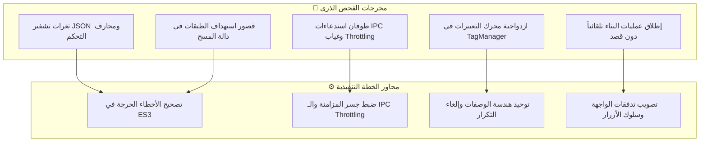

# 🛠️ خطة التصحيح والتصويب الهندسي الشاملة — Highlight Studio
### وثيقة تصويب الأخطاء، تحسين الأداء، وتطوير الخصائص الحالية (Bug Fixes, Hardening & Refinement Plan)

---

## 📑 الفهرس التنفيذي

1. [فلسفة الخطة ونطاق العمل](#1-فلسفة-الخطة-ونطاق-العمل)
2. [المصفوفة التشخيصية للأخطاء المكتشفة في الكود](#2-المصفوفة-التشخيصية-للأخطاء-المكتشفة-في-الكود)
3. [المحور الأول: تصحيح الأخطاء البرمجية الحرجة (Critical Bug Fixes)](#3-المحور-الأول-تصحيح-الأخطاء-البرمجية-الحرجة-critical-bug-fixes)
4. [المحور الثاني: تصويب وضبط الخصائص القائمة (Feature Rectifications & Hardening)](#4-المحور-الثاني-تصويب-وضبط-الخصائص-القائمة-feature-rectifications--hardening)
5. [المحور الثالث: توحيد المنطق وإلغاء الازدواجية المعمارية (Architectural De-duplication)](#5-المحور-الثالث-توحيد-المنطق-وإلغاء-الازدواجية-المعمارية-architectural-de-duplication)
6. [المحور الرابع: تصويب تجربة المستخدم في اللوحة (UI/UX Ergonomics & Safeguards)](#6-المحور-الرابع-تصويب-تجربة-المستخدم-في-اللوحة-uiux-ergonomics--safeguards)
7. [مراحل التنفيذ الهندسية والجدول الزمني](#7-مراحل-التنفيذ-الهندسية-والجدول-الزمني)
8. [خطة التحقق والفحص الصارم (Verification & Test Matrix)](#8-خطة-التحقق-والفحص-الصارم-verification--test-matrix)

---

## 1. فلسفة الخطة ونطاق العمل

> [!IMPORTANT]
> **قاعدة ذهبية لهذه الخطة**: لا توجد أي ميزات جديدة أو توسعات عشوائية (Zero Scope Creep).  
> التركيز بنسبة 100% موجه نحو: **تصحيح الأخطاء الكامنة في الكود، معالجة الحالات الحدية (Edge Cases)، إزالة التكرار، رفع استقرار وسرعة الخصائص الحالية، وتصويب أي سلوك غير متسق في الواجهة أو المحرك المضيف**.

تم استخراج بنود هذه الخطة بناءً على التشريح الذري الدقيق لجميع ملفات المشروع (8,530 سطر كود، 22 ملفاً، بيئة ExtendScript ES3 وجانب العميل CEP).



---

## 2. المصفوفة التشخيصية للأخطاء المكتشفة في الكود

| المعرف | الملف وموقعه | نوع الخلل | مستوى الخطورة | التأثير على المستخدم |
|---|---|---|:---:|---|
| **BUG-01** | `host/modules/Utils.jsx:87`<br/>`host/modules/ControllerBridge.jsx:164` | **ثغرة تشفير JSON (Tab & Control Chars)** | 🔴 **حرجة** | انهيار `JSON.parse` في المتصفح إذا احتوى النص على Tab `\t` أو محارف تحكم خاصة، مما يعطل مزامنة اللوحة كلياً. |
| **BUG-02** | `host/modules/HighlightBuilder.jsx:460` | **قصور استهداف الطبقات في `removeHighlight`** | 🟠 **عالية** | فشل زر المسح وظهور خطأ إذا حدد المستخدم طبقة الشكل (Shape Layer) بدلاً من طبقة النص، رغم ارتباطهما الأبوي المباشر. |
| **BUG-03** | `client/js/modules/Controls.js:396-397`<br/>`client/js/modules/Controls.js:50-51` | **طوفان استدعاءات IPC المتزامنة وغياب الخنق (Throttling)** | 🟠 **عالية** | إرسال استدعاءين متتاليين لكل نقرة سهم (input + change)، وإرسال 60+ استدعاء/ثانية أثناء السحب الأفقي مما يثقل After Effects ويملأ سجل التراجع. |
| **BUG-04** | `client/js/modules/Controls.js:98,143` | **إطلاق أوامر البناء عند تغيير الإعدادات بدون طبقة** | 🟡 **متوسطة** | النقر على شكل (مثل Pill) أو حركة يطلق فوراً أمر بناء في AE، مما يُظهر رسالة خطأ حمراء مربكة للمستخدم إذا لم يكن قد حدد طبقة بعد. |
| **BUG-05** | `host/modules/TagManager.jsx:600-935`<br/>مقابل `host/modules/Recipes.jsx` | **ازدواجية معمارية وتكرار صلب للتعبيرات** | 🟠 **عالية** | كود بناء العبارات يكرر صلب التعبيرات وحسابات الحجم بشكل مستقل عن `Recipes.jsx`، مما يفصل صيانة العبارات عن وصفات الأنماط والحركات. |
| **BUG-06** | `client/js/modules/PhraseManager.js:107` | **مطابقة غير محكمة للكلمات المكررة (Duplicate Words Indexing)** | 🟡 **متوسطة** | عند تكرار نفس الكلمة عدة مرات في أسطر مختلفة، قد يتم ربط الكلمة الخطأ إذا لم يعتمد البحث على الفهرس التراكمي الدقيق للسطر. |
| **BUG-07** | `host/modules/Recipes.jsx:85,208,218` | **توافقية كتل التعبيرات مع محرك JS الحديث في AE** | 🟡 **متوسطة** | وجود كتل مثل `{ 0; }` قد يسبب أخطاء تقييم (Evaluation Warnings) في محرك JavaScript الحديث لـ After Effects (CC 2019+). |
| **BUG-08** | `client/js/modules/PresetsManager.js:386` | **اعتماد `confirm()` التقليدي المانع لمسار التنفيذ** | 🔵 **منخفضة** | ظهور نافذة تأكيد منبثقة بنمط المتصفح القديم تعطل المظهر الصناعي الموحد للإضافة. |

---

## 3. المحور الأول: تصحيح الأخطاء البرمجية الحرجة (Critical Bug Fixes)

### 3.1 تصحيح ثغرة تشفير نصوص الـ JSON في ExtendScript (BUG-01)
* **المشكلة الحالية**: دالة `escMeta(s)` في `Utils.jsx` تقوم فقط بتهريب:
  ```javascript
  String(s).replace(/\\/g, "\\\\").replace(/"/g, '\\"').replace(/\r/g, "\\r").replace(/\n/g, "\\n");
  ```
  عندما يحتوي نص المستخدم في After Effects على علامات جدولة (`\t`) أو محارف تحكم (`\b`, `\f`)، تُرسل السلسلة مشوهة إلى `ControllerBridge.jsx` في استجابة `getLayerState`، فيفشل `JSON.parse(resStr)` في `SyncService.js` فوراً بصمت أو يوقف التحديث.
* **التصويب المعتمد**:
  إنشاء دالة تهريب موحدة وشاملة لمعايير ECMA-262:
  ```javascript
  $._smartHighlighter.escapeJSON = function (s) {
      if (s === null || s === undefined) return "";
      return String(s)
          .replace(/\\/g, "\\\\")
          .replace(/"/g, '\\"')
          .replace(/\r/g, "\\r")
          .replace(/\n/g, "\\n")
          .replace(/\t/g, "\\t")
          .replace(/[\b]/g, "\\b")
          .replace(/\f/g, "\\f");
  };
  ```
  واستبدال جميع تجميعات السلاسل النصية اليدوية في `ControllerBridge.jsx` بالاعتماد على دالة التحويل الموحدة `$._smartHighlighter.stringifyJSON()`.

---

### 3.2 تصويب استهداف الطبقات في دالة مسح الهايلايت (BUG-02)
* **المشكلة الحالية**: في `HighlightBuilder.jsx`:
  ```javascript
  if (comp.selectedLayers.length !== 1 || !(comp.selectedLayers[0] instanceof TextLayer)) {
      return "ERROR: يرجى تحديد طبقة النص المراد مسح الهايلايت منها.";
  }
  ```
  إذا قام المستخدم بالنقر على أي مستطيل هايلايت على شاشة الـ Composition وضغط على زر الحذف، تفشل العملية رغم أن طبقة التظليل مرتبطة مباشرة عبر `lyr.parent` بطبقة النص المستهدفة.
* **التصويب المعتمد**:
  توحيد منطق التعرف على الطبقات:
  ```javascript
  var sel = comp.selectedLayers[0];
  var textLayer = null;
  if (sel instanceof TextLayer) {
      textLayer = sel;
  } else if (sel instanceof ShapeLayer && sel.parent && (sel.parent instanceof TextLayer)) {
      textLayer = sel.parent;
  }
  if (!textLayer) {
      return "ERROR: يرجى تحديد طبقة النص أو إحدى طبقات الهايلايت المرتبطة بها.";
  }
  ```

---

### 3.3 تصحيح صياغة كتل التعبيرات لضمان التوافقية المزدوجة (BUG-07)
* **المشكلة الحالية**: بعض الأسطر في `Recipes.jsx` و `TagManager.jsx` تكتب شروط التعبيرات هكذا:
  ```javascript
  if (pVal <= c1) { 0; } else if (pVal >= c2) { 100; } else { linear(pVal, c1, c2, 0, 100); }
  ```
  في بعض إصدارات After Effects الحديثة مع تفعيل محرك **JavaScript Expression Engine**، كتل الأقواس بدون إسناد صريح قد تسفر عن تحذيرات أو تفشل في تمرير القيمة.
* **التصويب المعتمد**:
  صياغة العبارات الرياضية كـ Expressions معيارية صريحة:
  ```javascript
  (pVal <= c1) ? 0 : ((pVal >= c2) ? 100 : linear(pVal, c1, c2, 0, 100));
  ```
  مما يضمن عمل التعبير بكفاءة مطلقة على كلا المحركين: Legacy ExtendScript و Modern JavaScript.

---

## 4. المحور الثاني: تصويب وضبط الخصائص القائمة (Feature Rectifications & Hardening)

### 4.1 ضبط محرك الـ IPC Throttling ومنع الازدواجية في التحكم المباشر (BUG-03)
* **المشكلة الحالية**:
  1. أزرار الـ Steppers تطلق حدثين متتاليين (`input` ثم `change`)، وكل منهما يستدعي `HS.Controls.applyLiveParam`.
  2. سحب القيم بالفأرة (Mouse Drag Scrubbing) يرسل استدعاءات متلاحقة دون أي فاصل زمني، مما يسبب تجمد الواجهة أثناء السحب السريع.
* **التصويب المعتمد**:
  - إلغاء الاستماع المزدوج لـ `input` و `change`، والاكتفاء بمعالج واحد موحد.
  - تطبيق نمط **Throttling عبر `requestAnimationFrame`** أو مؤقت 40ms:
  ```javascript
  HS.Controls.liveParamThrottleTimer = null;
  HS.Controls.applyLiveParamThrottled = function (paramName, val) {
      HS.markInteraction();
      if (HS.Controls.liveParamThrottleTimer) {
          cancelAnimationFrame(HS.Controls.liveParamThrottleTimer);
      }
      HS.Controls.liveParamThrottleTimer = requestAnimationFrame(function () {
          HS.Controls.applyLiveParam(paramName, val);
          HS.Controls.liveParamThrottleTimer = null;
      });
  };
  ```

---

### 4.2 تصويب خوارزمية تقسيم وفهرسة الكلمات المتكررة في لوحة العبارات (BUG-06)
* **المشكلة الحالية**: في `PhraseManager.js:renderBoard`:
  ```javascript
  var exactPos = rawText.indexOf(wordStr, searchCursor);
  ```
  إذا كان النص يحتوي على أسطر متعددة وفوارق أسطر غير متجانسة (`\r\n` مقابل `\n`)، أو كلمات متطابقة متكررة على نفس السطر، قد يحدث انزياح في `searchCursor` يسبب عدم تطابق بين الكلمة المحددة في الواجهة وموقعها في After Effects.
* **التصويب المعتمد**:
  - اعتماد خوارزمية **تتبع المواقع المطلقة الصارمة (Absolute Regex Match Tracking)** بناءً على النص الكامل الأصلي وليس عبر تقسيم الأسطر اليدوي المنفصل، لضمان تطابق `charStart` و `charEnd` بنسبة 100% مع حسابات `TextScanner.jsx` في المضيف.
  - حماية لوحة الكلمات عند استلام نصوص ضخمة باستخدام `DocumentFragment` لتوليد عناصر الـ DOM دفعة واحدة، مما يقضي تماماً على أي بطء أو وميض عند قراءة نصوص طويلة.

---

### 4.3 تصويب ومزامنة شارات العبارات عند الحذف اليدوي من الـ Timeline
* **المشكلة الحالية**: إذا قام المستخدم بتطبيق تظليلات على 3 عبارات، ثم قام يدوياً بحذف طبقة إحدى العبارات من لوحة After Effects (الـ Timeline) دون استخدام اللوحة، فإن `syncAppliedPhrases` قد يظل محتفظاً بحالة التظليل القديمة إذا لم يُجبر على إعادة قراءة تعليقات الطبقات المتبقية.
* **التصويب المعتمد**:
  - تعزيز دالة `syncAppliedPhrases()` لتقوم بالمقارنة الحية بين الطبقات الفعلية في التركيبة ومحتوى الـ DOM، وإزالة أي شارة تظليل فوراً إذا لم تعد طبقتها الفيزيائية موجودة في AE.

---

## 5. المحور الثالث: توحيد المنطق وإلغاء الازدواجية المعمارية (Architectural De-duplication)

### 5.1 ربط `TagManager.jsx` بـ `Recipes.jsx` وإلغاء الكود المكرر (BUG-05)
* **الخلل المعماري الحالي**:
  - ملف `TagManager.jsx` يحتوي على **1,226 سطراً**؛ نحو 400 سطر منها عبارة عن إعادة كتابة حرفية لمنطق بناء التعبيرات (Typewriter, Pop, Wipe, Snap) وأنماط الأشكال (Box, Pill, Marker, Underline, Outline) المكتوبة بالفعل داخل `Recipes.jsx`.
  - هذا الفصل يمثل خطراً برمجياً جسيماً؛ فأي تعديل أو إصلاح لمعادلة فيزيائية في `Recipes.jsx` لا ينعكس على تظليل العبارات في `TagManager.jsx`.
* **التصويب المعتمد**:
  1. إعادة هيكلة دالة `buildPhraseHighlights` في `TagManager.jsx` لتعتمد كلياً على نمط الاستراتيجية (Strategy Pattern) المتاح في `$._smartHighlighter.recipes.getStyle()` و `$._smartHighlighter.recipes.getMotion()`.
  2. اختصار ملف `TagManager.jsx` من 1,226 سطر إلى ما يقارب 750 سطر مع الاحتفاظ بكافة وظائفه ولكن بنقاء معماري تام يمنع تكرار الكود (DRY Principle).

---

## 6. المحور الرابع: تصويب تجربة المستخدم في اللوحة (UI/UX Ergonomics & Safeguards)

### 6.1 فك الارتباط بين أزرار الضبط وعمليات البناء التلقائي (BUG-04)
* **المشكلة الحالية**:
  عندما يضغط المستخدم على أي زر شكل (مثل Pill أو Box) أو زر حركة في الواجهة، يتم استدعاء `HS.Actions.executeSmartAction(false)` مباشرة. إذا كان المستخدم في بداية عمله ولم يحدد طبقة بعد، تطلق اللوحة خطأ أحمر ينبه المستخدم بعدم تحديد طبقة.
* **التصويب المعتمد**:
  - فحص وجود هايلايت قائم أولاً:
    - إذا كانت الطبقة المحددة في AE **تحتوي بالفعل على هايلايت قائم** (`state.hasHighlight === true`)، يتم السماح بالتحديث المباشر للشكل/الحركة لتوفير تجربة تفاعلية حية (Live Re-skinning).
    - إذا لم تكن هناك طبقة محددة أو لم يكن عليها هايلايت، فإن النقر يكتفي بتحديث حالة الواجهة والأزرار دون إرسال أمر بناء كامل، تاركاً أمر التطبيق لزر **Apply Highlight**.

---

### 6.2 استبدال الـ Native `confirm()` بحوار مدمج بنظام التصميم (BUG-08)
* **المشكلة الحالية**: عند حذف قالب في `PresetsManager.js`:
  ```javascript
  if (confirm("Delete preset \"" + pName + "\"?")) { ... }
  ```
  هذا يستدعي نافذة النظام التشغيلي المتنافرة مع هوية الواجهة الداكنة (Dark Industrial Theme).
* **التصويب المعتمد**:
  - استبدالها بنافذة تأكيد سريعة داخل اللوحة (Inline Zero-Radius Confirmation Toast) تتفق 100% مع قواعد التصميم المعتمدة (0-radius، تباين صامت، زر تأكيد وزر إلغاء).

---

### 6.3 فحص سلامة وتصحيح بيانات الـ Presets (Schema Validation)
* **المشكلة الحالية**: إذا كانت البيانات المخزنة في `localStorage` تفتقر لأحد الحقول (مثل غياب `padX` أو `opacity` في قالب قديم)، يتم تمرير `undefined` إلى دوال الحساب فينتج عنه `NaN` في حقول الواجهة.
* **التصويب المعتمد**:
  - وضع طبقة فحص وتصويب تلقائي (Sanitizer & Fallback):
  ```javascript
  function sanitizePreset(raw) {
      return {
          name: raw.name || "Untitled Preset",
          color: raw.color || "#3C4BB9",
          style: raw.style || "box",
          motion: raw.motion || "typewriter",
          paddingX: (typeof raw.paddingX === "number") ? raw.paddingX : 10,
          paddingY: (typeof raw.paddingY === "number") ? raw.paddingY : 10,
          roundness: (typeof raw.roundness === "number") ? raw.roundness : 0,
          opacity: (typeof raw.opacity === "number") ? raw.opacity : 100
      };
  }
  ```

---

## 7. مراحل التنفيذ الهندسية والجدول الزمني

```mermaid
gantt
    title مراحل تصحيح وتصويب Highlight Studio
    dateFormat  X
    axisFormat %s
    section المرحلة 1: الأخطاء الحرجة في المحرك المضيف
    تصحيح تشفير JSON ومحارف التحكم (Utils.jsx)      :crit, p1, 0, 2
    تصويب استهداف الطبقات في removeHighlight        :crit, p2, 1, 3
    تصحيح كتل التعبيرات لمحرّك JS الحديث             :p3, 2, 4
    section المرحلة 2: الأداء والتحكم في الواجهة
    تطبيق خنق الاستدعاءات Throttling في Controls.js  :p4, 3, 5
    تصويب سلوك أزرار الأشكال ومنع رسائل الخطأ العشوائية:p5, 4, 6
    section المرحلة 3: توحيد المنطق وإلغاء الازدواجية
    ربط TagManager.jsx بـ Recipes.jsx وتفكيك التكرار :p6, 5, 8
    تصويب خوارزمية الفهرسة للكلمات المكررة           :p7, 6, 8
    section المرحلة 4: التحقق الصارم وضبط التجربة
    استبدال confirm() التقليدي بنافذة مدمجة          :p8, 7, 9
    فحص التوافقية والتأكد من خلو الأخطاء            :p9, 8, 10
```



---

## 8. خطة التحقق والفحص الصارم (Verification & Test Matrix)

لكل تصحيح تم إقراره في هذه الخطة، يتم تطبيق سيناريو اختبار صارم للتحقق من نجاحه:

| البند المصحح | سيناريو الاختبار (Test Case) | النتيجة المتوقعة بعد التصحيح |
|---|---|---|
| **تشفير JSON (`Utils.jsx`)** | كتابة نص في After Effects يحتوي على علامات جدولة متعددة `\t` وأسطر فارغة، ثم التبديل لتبويب العبارات. | يتم قراءة النص ومزامنته في لوحة الكلمات بسلاسة تامة دون أي خطأ في وحدة التحكم. |
| **المسح الذكي (`removeHighlight`)** | تطبيق هايلايت على نص، ثم تحديد إحدى طبقات الشكل (Shape Layer) الناتجة مباشرة والضغط على زر الحذف. | يتم التعرف على الطبقة الأم فوراً ومسح كافة طبقات الهايلايت بنجاح ونظافة. |
| **خنق التحكم (`IPC Throttling`)** | سحب قيمة Padding X أو الهوامش بسرعة ذهاباً وإياباً بالفأرة 10 مرات متتالية. | حركة سلسة تماماً في AE بدون تأخير أو تراكم لعشرات عمليات التراجع في سجل الـ Undo. |
| **سلوك الأزرار (`Controls.js`)** | فتح الإضافة دون تحديد أي طبقة، والنقر على أزرار الأشكال (Pill, Marker, etc.). | تتبدل حالة الزر البصرية والداخلية في اللوحة بهدوء، دون ظهور أي خطأ أحمر في شريط الحالة. |
| **الكلمات المتكررة (`PhraseManager`)** | إدخال نص يحتوي على كلمات شائعة مكررة: *"هذا هو النص وهذا هو التطبيق"*. تحديد كلمة "هو" الثانية فقط. | يتم تظليل كلمة "هو" الثانية بدقة بالغة في الموقع الصحيح دون القفز للكلمة الأولى. |
| **تعبيرات المحرك الحديث** | ضبط محرك التعبيرات في مشروعات After Effects على JavaScript، وتطبيق الهايلايت بالحركة التذبذبية Pop. | تنفيذ الحركة باهتزاز زنبركي فائق الدقة بدون أي بانر خطأ برتقالي في برنامج After Effects. |

---

<p align="center"><sub>تم بناء وتوثيق هذه الخطة الهندسية بناءً على الفحص الشامل لشيفرة المصدر — سبتمبر 2026</sub></p>
