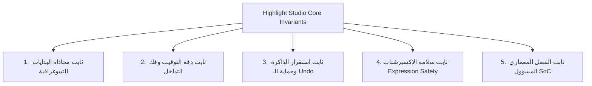

# خطة التحصين الشامل وبناء أساس المكتبة الصلبة (Highlight Studio Core Engine)
> **وثيقة معمارية لحماية المشروع وتحويله إلى محرك ومكتبة موشن تيبوغرافي من الدرجة الإنتاجية (Production-Grade & Zero-Regression)**

---

## 1. الرؤية والهدف الاستراتيجي (Vision & Objective)
الهدف من هذه الخطة هو الانتقال بـ **Highlight Studio** من مجرد "إضافة CEP عادية تعمل حالياً" إلى **"محرك تيبوغرافي ومكتبة هندسية صلبة"**.
تضمن هذه المعمارية:
1. **استحالة ضياع أي ميزة أو تفصيلة (Zero Feature Loss):** مهما تكررت التعديلات أو تعاقب المطورون.
2. **منع الانتكاسات البرمجية نهائياً (Zero Regressions):** لا يمكن لتحديث جديد أن يفسد السلوك المستقر القديم.
3. **القابلية العالية للتوسع (Extensible by Design):** إضافة أنماط تظليل وحركات جديدة بسهولة عبر نظام إضافات مفتوح (Plugin / Recipe Architecture).

---

## 2. مصفوفة الثوابت الهندسية والمحرمات (Architectural Invariants)
هذه القواعد تعتبر بمثابة **"الدستور البرمجي الصارم"** للمشروع، ويحظر كسرها تحت أي ظرف:



### أ. ثابت محاذاة بدايات الأسطر (Line Start Alignment Invariant)
* **القاعدة:** في نمط الأسطر (`mode: "lines"`):
  * في النصوص اللاتينية (`LTR`): **طرف البداية (اليسار)** لجميع الحاويات يجب أن يشكل **خطاً عمودياً مستقيماً 100% كالمسطرة** (`leftOffset = 0`).
  * في النصوص العربية (`RTL`): **طرف البداية (اليمين)** لجميع الحاويات يجب أن يشكل **خطاً عمودياً مستقيماً 100% كالمسطرة** (`rightOffset = 0`).
  * الفراغات الجانبية للمحارف (`Left/Right Side Bearings`) تُدمج بالكامل في حساب عرض الحاوية (`boxWidth = ld.width + offset`) ولا يجوز أبداً أن تزيح بداية الحاوية للداخل.
  * **طرف النهاية:** يظل حراً وديناميكياً بنسبة 100% وفقاً لعدد كلمات السطر، وينتهي بدقة متناهية بعد آخر حرف مع البادينج المحدد (`pX`).

### ب. ثابت تزامن التايب رايتر (Typewriter Sync Invariant)
* **القاعدة:** حركة الطباعة الآلية (`cOffsets` و `wOffsets`) تبدأ من خط الصفر المحاذى وتتسق هندسياً مع خط البدايات المستقيم لضمان عدم حدوث قفزة بصرية عند ظهور أول حرف.

### ج. ثابت نظام التوقيت وتفكيك الكود الزمني (Timecode & Timing Engine Invariant)
* **القاعدة:**
  * **واجهة المستخدم (UI):** توفر خانات منفصلة ومريحة للمستخدم (دقيقة : ثانية : فريم).
  * **المحرك الداخلي (Core Engine):** يتعامل دائماً مع الوقت بالثواني الحقيقية الدقيقة (`totalSeconds = min*60 + sec + frames/fps`).
  * **التوقيت المطلق:** التوقيت الذي يحدده المستخدم (مثل البدء عند الثانية 1:00) مقدس هندسياً، وتتحرك الكي فريمات لمطابقته في الزمن الفعلي للكومبوزيشن دون أي انزياح أو تأخير تلقائي.
  * **حسابات الخروج (Outro):** يبدأ الخروج دائماً عند `outPt - outDur`، ويُمنع منعاً باتاً تداخل كي فريمات الدخول مع الخروج (`k2.time <= k3.time`).

### د. ثابت حماية الـ Undo وتوازن بيئة After Effects (Zero Undo-Leaks)
* **القاعدة:** كل أمر تنفيذي من الإضافة يجب أن يكون محصوراً في مجموعة تراجع ذرية واحدة:
  ```javascript
  app.beginUndoGroup("Action Name");
  try {
      // التنفيذ الآمن
  } finally {
      app.endUndoGroup();
  }
  ```
  ويُمنع منعاً باتاً ترك أي طبقة مؤقتة (Guide Layers للمسح) في المشروع عند حدوث استثناء (`finally cleanup`).

---

## 3. خطة إنشاء حزمة الاختبارات الآلية الرسمية (`tests/`)
سنقوم بنقل الاختبارات المعتمدة من مسودة التجارب إلى مجلد رسمي داخل المستودع:

```text
tests/
├── run_all.js                     # منفذ الاختبارات الشامل بنقرة واحدة
├── unit/
│   ├── typography_alignment.test.js  # فحص استقامة البدايات في LTR, RTL, Justified
│   ├── timecode_math.test.js         # فحص تجزئة وتحويل الدقائق والثواني والفريمات
│   └── timing_invariants.test.js     # فحص دقة الـ In/Out وعدم تداخل الكي فريمات
└── integration/
    ├── expression_syntax.test.js     # فحص سلامة بناء إكسبرشنات After Effects
    └── undo_groups.test.js           # فحص اتزان مجموعات التراجع وعدم تسريبها
```

### مزايا الاختبارات الآلية:
- تعمل بواسطة Node.js القياسي في أقل من ثانيتين.
- تعطي تقريراً أخضر مفصلاً بكل خاصية تم اختبارها وتأكيد سلامتها.
- تعمل محلياً ومستقبلاً عبر CI/CD (GitHub Actions).

---

## 4. خطة الحراسة الآلية قبل الحفظ (Git Pre-Commit Guard)
لضمان استحالة رفع كود يحتوي على أي خلل:
1. يتم تفعيل Git Hook يقوم قبل أي عملية `git commit` بتشغيل:
   ```bash
   node tests/run_all.js
   ```
2. في حال فشل أي اختبار (مثلاً: سطر لم يصطف عمودياً كالمسطرة، أو دالة توقيت حُسبت بشكل خاطئ)، يقوم Git بإلغاء العملية فوراً وتنبيه المطور بالسطر الذي تسبب في الخطأ.

---

## 5. معمارية التوسع كمكتبة برمجية (Extensible Recipe Architecture)
المشروع مبني بالفعل وفق مبدأ **Open-Closed Principle** (مفتوح للتوسع، مغلق أمام التعديل المباشر المخرّب):

### إضافة نمط بصري جديد (Style Recipe):
لإضافة ستايل جديد مستقبلاً (مثل نمط `outline_frame` أو `gradient_brush`):
```javascript
$._smartHighlighter.recipes.registerStyle("outline_frame", {
    name: "Outline Frame",
    createLayer: function (comp, ctx) { /* ... */ },
    applyProperties: function (layer, ctx) { /* ... */ },
    getSizeExpression: function (ctx) { /* ... */ },
    getPositionExpression: function (ctx) { /* ... */ }
});
```
*يتم وضعه في ملف مستقل يُدرج تلقائياً دون لمس الأنماط القديمة أو المخاطرة بها.*

### إضافة حركة جديدة (Motion Dynamics Recipe):
لإضافة حركة جديدة (مثل نمط `spring_wobble` أو `glitch_reveal`):
```javascript
$._smartHighlighter.recipes.registerMotion("spring_wobble", {
    name: "Spring Wobble",
    isTypewriter: false,
    applyTransformScale: function (scaleProp, ctx) { /* ... */ },
    getWidthSnippet: function (ctx) { /* ... */ }
});
```

---

## 6. خطوات التنفيذ والجدول الزمني الموصى به

| المرحلة | المهام | النتيجة الملموسة |
| :--- | :--- | :--- |
| **المرحلة 1: التوثيق والاعتماد** | اعتماد هذه الوثيقة في المستودع ودمجها | دستور هندسي واضح محفوظ في Git |
| **المرحلة 2: حزمة الاختبارات** | إنشاء مجلد `tests/` وملفات الفحص الآلي | اختبار شامل بضغطة زر واحدة `npm test` |
| **المرحلة 3: أتمتة الحراسة** | ضبط Git Hook لمنع الـ Commits الخاطئة | حماية آلية 100% ضد أي انتكاسات |
| **المرحلة 4: التوثيق العام API** | توثيق دوال الـ Host Engine للمطورين | مكتبة جاهزة للاستخدام البرمجي المتقدم |
